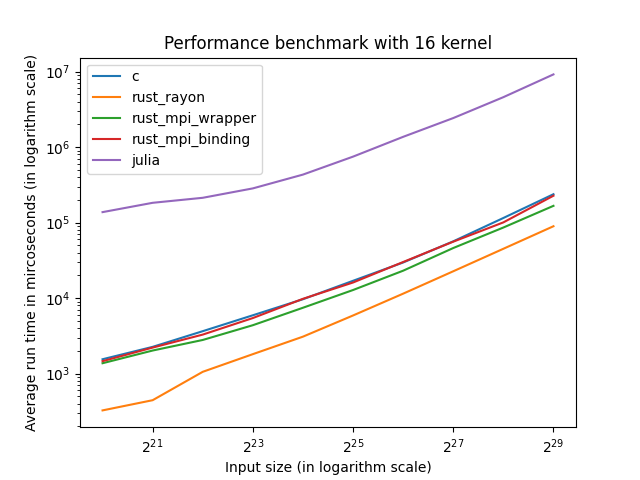

# Parallel Bench

本仓库粗糙地比较了C、Rust和Julia在并行方面的性能。

## 任务

由manager随机生成固定大小（2的整数次幂）的数组，程序读取并求和。

## 并行算法

对于使用MPI的`c-adder`，`rust-mpi-adder-binding`，`rust-mpi-adder-wrapper`和`julia-adder`，并行算法为：

* 数据传输阶段

  每个进程将接收的数组对半分，一半传输给下一节点（准确说是`next_rank = 2 * next_rank`）。不断对半分，直到找不到下一节点为止。

  对于节点数为`n`，这一步骤的时间复杂度为`O(log(n))`
* 数据计算阶段

  将剩余的数组内元素求和。

  对于节点数为`n`，input规模为`m`，这一步骤总共需要计算`m/log(n) - 1`次加法
* 数据收集阶段

  每个进程将得到的结果反馈给上一进程，上一进程将结果求和，再次重复这个操作，直到最终返回给0号进程。

  对于节点数为`n`，数据传输需要`O(log(n))`，最后求和需要计算`log(n)`次加法

## 语言实现

### `c-adder`

使用C语言的MPI实现。

### `rust-mpi-adder-binding`和`rust-mpi-adder-wrapper`

Rust的MPI库是[mpi](https://crates.io/crates/mpi)。这个库对MPI的接口做了一定的封装。但是因为是今年7月才release的库，还有待打磨。

`rust-mpi-adder-wrapper`直接使用了这个库作为MPI调度接口。`rust-mpi-adder-binding`则使用了更底层的[mpi-sys](https://crates.io/crates/mpi-sys)，直接调用C接口的binding。

### `rust-rayon-adder`

[Rayon](https://crates.io/crates/rayon)是Rust原生写的并行算法库。但是与MPI不同的是，这个库的调度单元是线程，所以数据传输的开销非常低。虽然开销更低，但是不适合分布式环境。由于使用起来非常简单（只需要一行代码），所以也放在这里一起比较。

### `julia-adder`

使用了[MPI.jl](https://juliaparallel.org/MPI.jl/stable/)库作为MPI调度接口。

## MPI接口调用

* 进程在接收上一进程传递来的数组时，首先使用`MPI_MProbe`和`MPI_Get_count`获得数组的元素个数，然后创建相应大小的缓冲区，使用`MPI_Mrecv`获得相应的数据
* 进程使用`MPI_Isend`将数组对半分后传递给下一进程
* 进程使用`MPI_Recv`等待下一进程回传。因为这里阻塞了，所以不需要在上一步`MPI_Isend`中阻塞等待或是管理同步
* 进程使用`MPI_Send`将计算结果回传给上一进程

## 环境

本实验的环境为16核Intel Core i9 12900K，64GB内存，Ubuntu 22.04.1系统。

MPI实现使用的是MPICH 4.0-3。

C语言使用了`mpicc`编译器，在编译时使用了`-cc=clang`，保证了与Rust同样使用LLVM的优化。

Rust版本为1.64.0。

Julia版本为1.8.2。

除Julia外，其余实验均采用`clock_gettime`系统调用计时；Julia采用的是内置的`time_ns()`，理论上精度更高。

## 编译

### C

```shell
mpicc -lmpi c-adder.c -O3 -o c-adder
```

采用了`O3`优化

### Rust

```shell
cargo build --release --workspace
```

采用了`release`编译选项

## 运行结果

初步结果位于[bench_result.json](./bench_result.json)文件中，分析的结果可以在[analysis_output](./analysis_output/)目录下查看。

一些比较有意思的结果：

### Fixed input size 2^29


### Fixed kernel count 16



### 加速比

#### 固定输入大小为2^28


也许基本是强可扩展性算法？

#### 同步增加输入大小与核数


基本为弱可扩展性算法。

## 解释与分析

### 结果的准确性

由于一些客观因素的限制，结果并非完全准确。例如：

* 我是在平时工作的机器上运行的，在该程序运行的过程中，难免会让机器跑别的任务，对程序可能会有一定的影响。但我每个set跑了16次，最终取平均，应该还算准确。
* 我的机器是我自己装的，用的是猫头鹰D15S的风冷。但实际上在核数到达16核的时候，基本上相当于在烤机了。众所周知，风冷压不住i9，也许猫头鹰这种顶级风冷勉强可以，但也许会降频。

### Julia

Julia性能较低，有可能是因为我不太熟悉Julia，没有合理优化。在Julia中：

* 在传递数组时，仅使用`MPI_Send`而非`MPI_Isend`。这是因为即使加了`MPI_Wait`，还是会有奇怪的同步问题。并且理论上是不需要加`MPI_Wait`的。
* Julia的MPI库不提供`MPI_Mrecv`，所以`MPI_Probe`后还需`MPI_Recv`，性能不如`MPI_Mprobe`后`MPI_Mrecv`，可以减少一次通信。

### Rust MPI Wrapper

Rust的MPI wrapper比C语言快，这是非常棒的结果。分析了一下两者产生的二进制程序，其调用的MPI接口应该是一致的。优化应该是程序逻辑结构以及求和时的优化。

### Rust MPI Binding

用Rust的MPI Binding写出来的程序性能和C语言相当。但是由于常量访存和inline的问题（可见[rsmpi/rsmpi#137](https://github.com/rsmpi/rsmpi/issues/137)），有可能会稍微慢一些些。此外，值得注意的是，Rust因为有完善的变量生存周期检查机制，所以可以极大地优化程序性能。但是对于binding这种多语言交互的情况，也只能优化Rust代码本身的性能。如果要Rust写的MPI更快，得用Rust重写整个MPI实现，但似乎现在还没人做。所以Rust写MPI，并不能比C写MPI得到更好的性能，但肯定不至于更差。

## 未来工作

可以考虑使用Rust上原生的进程级并行库（目前还没找到）以及Julia的原生[分布式计算库](https://docs.julialang.org/en/v1/stdlib/Distributed/)作benchmark。
